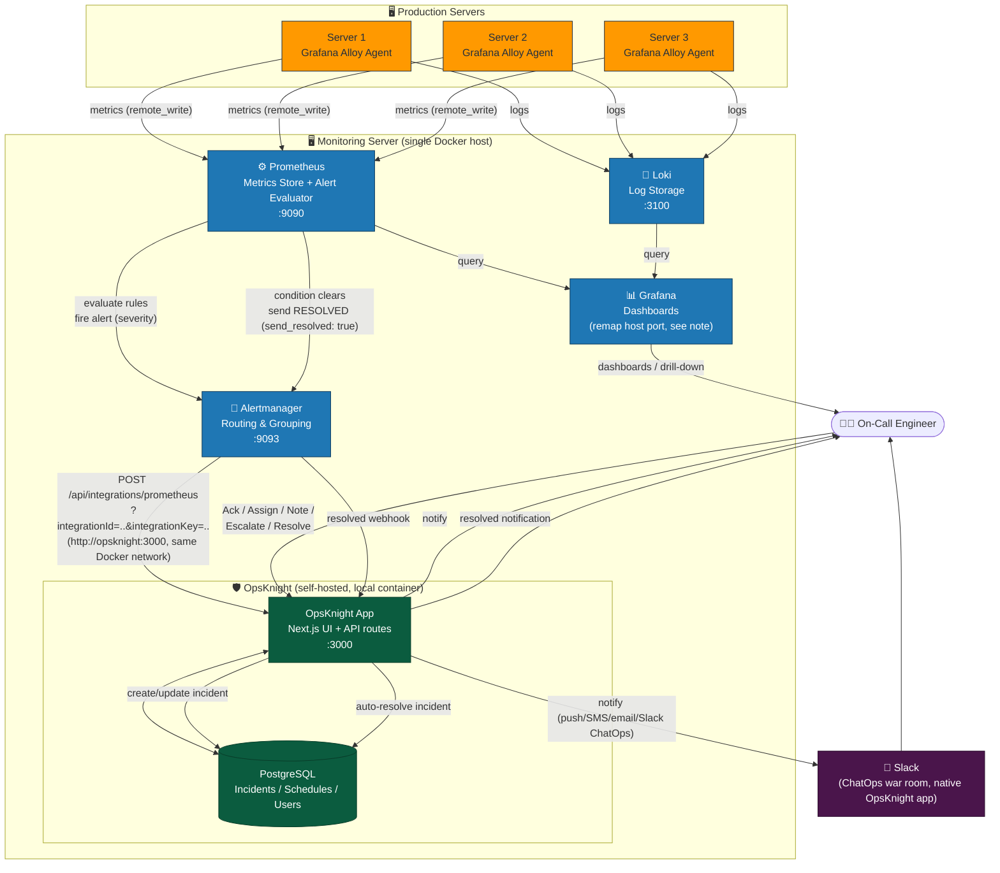
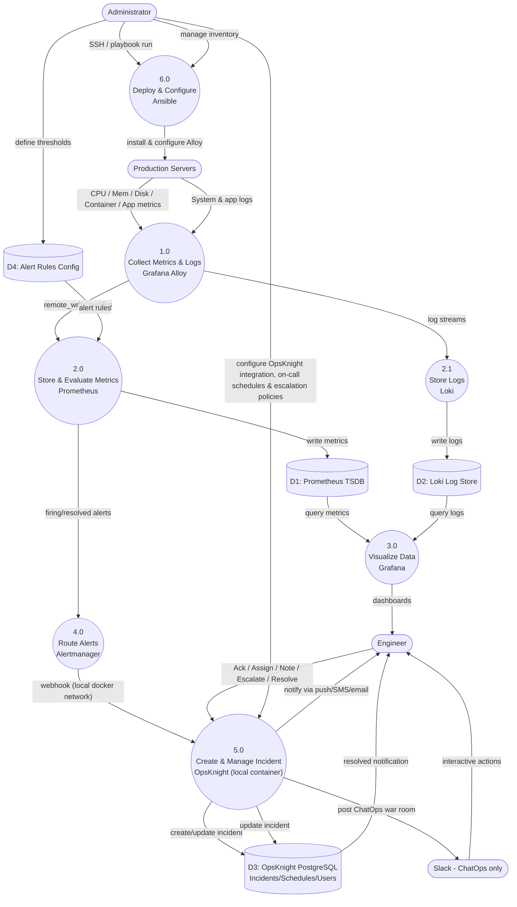
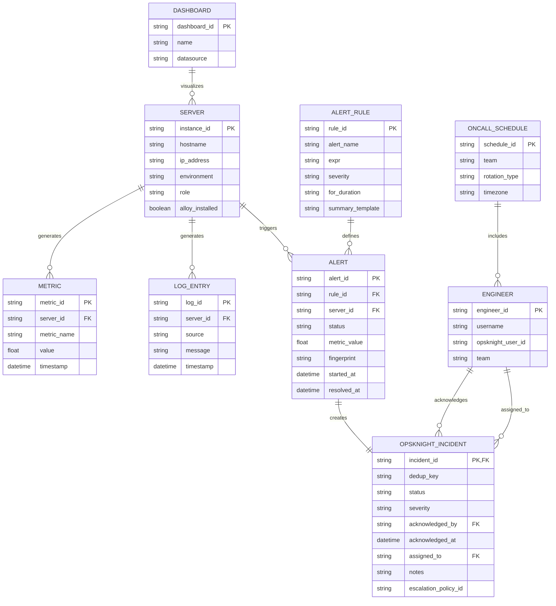
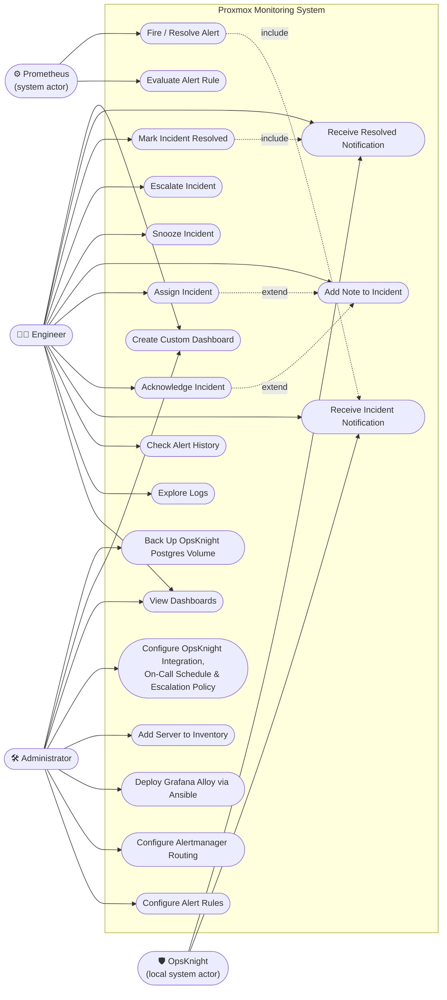
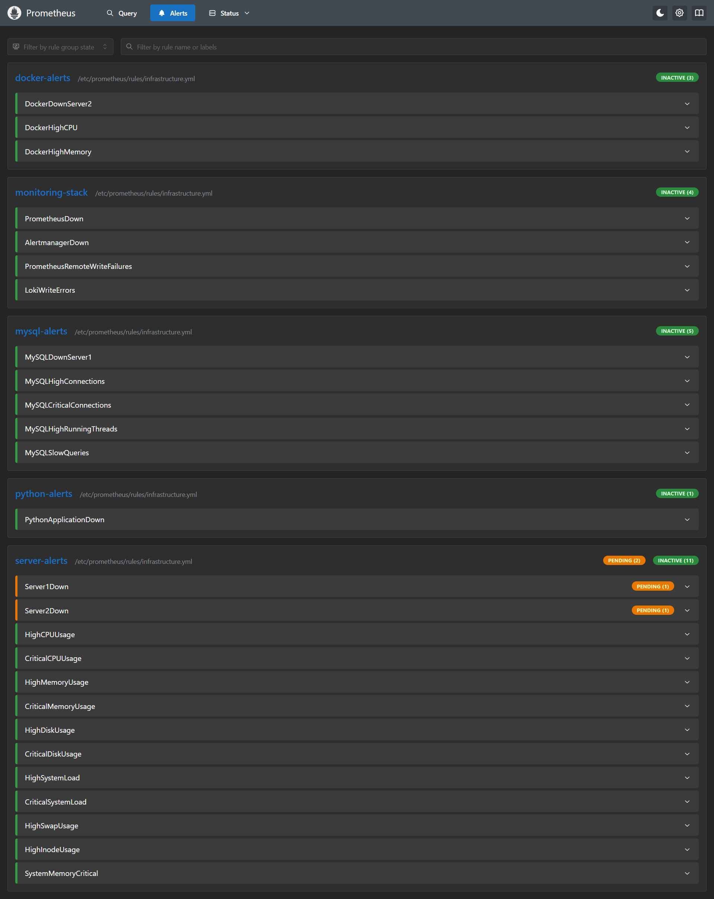
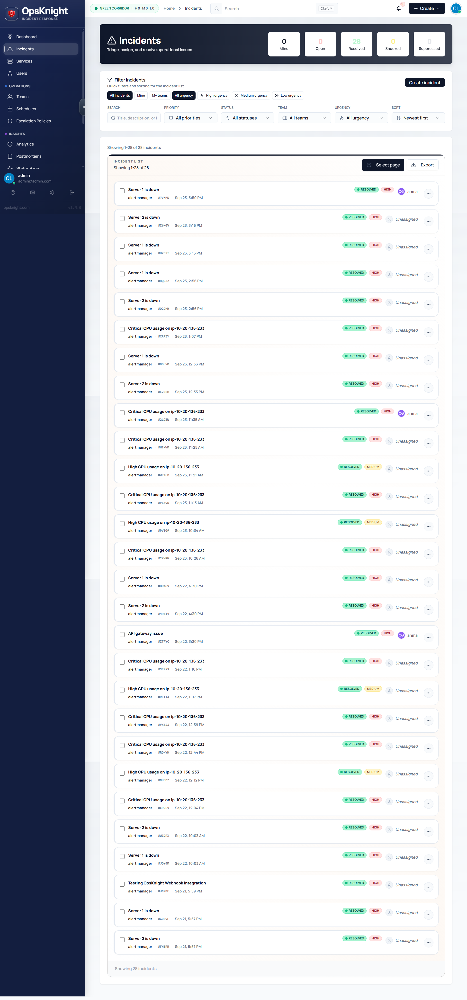
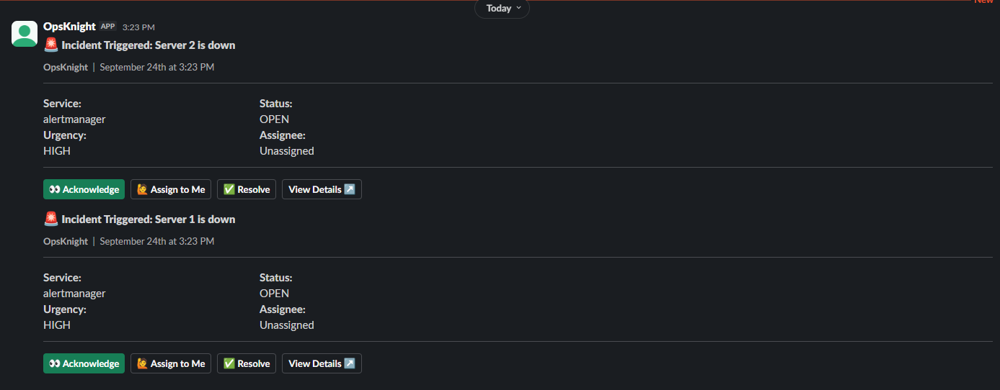

# Proxmox Production Monitoring System

[](https://github.com)
[](LICENSE)
[](https://www.linux.org)
[](https://www.docker.com)

A **production-grade, centralized monitoring and alerting platform** for Proxmox on-premises servers with real-time dashboards, intelligent alerting, and incident management via a **self-hosted OpsKnight instance running locally in Docker** (no cloud/SaaS dependency).

[Features](#features) • [Quick Start](#quick-start) • [Architecture](#architecture) • [Deployment](#deployment) • [Troubleshooting](#troubleshooting)

---

## 📋 Table of Contents

- [Overview](#overview)
- [Features](#features)
- [System Architecture](#system-architecture)
- [Components](#components)
- [Complete Workflow](#complete-workflow)
- [System Diagrams (DFD / ERD / Use Case)](#system-diagrams-dfd--erd--use-case)
- [Deployment Guide](#deployment-guide)
- [Configuration](#configuration)
- [Monitoring & Dashboards](#monitoring--dashboards)
- [Alert / Incident Management (OpsKnight)](#alert--incident-management-opsknight)
- [Troubleshooting](#troubleshooting)
- [Security](#security)
- [Quick Reference](#quick-reference)

---

## 📌 Overview

> **Purpose:** A production-style, centralized monitoring and alerting platform for Proxmox/on-premises servers.
>
> This document is written so that a **new engineer can understand the system from zero**, deploy it, test it, and troubleshoot it **without needing to know the original implementation history**.

The Proxmox Monitoring System continuously watches:
- 🖥️ Servers
- 🐳 Containers & applications  
- 💾 Databases & system resources
- 📝 Logs & events

When something goes wrong, the system automatically detects the problem and hands it off to **OpsKnight** — running as a **local Docker container on the monitoring server itself** — which turns it into a managed incident and notifies the on-call engineer.

> **Note on this change:** Incident handling previously ran through a self-built Flask "Alert Action Service" that posted interactive messages to Slack and tracked state in a local JSON file. That component has been **removed and replaced by [OpsKnight](https://github.com/opsknight-labs/OpsKnight)**, an open-source, self-hosted incident management platform (Apache-2.0). OpsKnight is **not** a SaaS/cloud product here — it runs as its own Docker container (Next.js app + PostgreSQL) alongside the rest of the monitoring stack, on infrastructure you control. Alertmanager sends alerts directly to OpsKnight's built-in Prometheus integration endpoint, and OpsKnight owns notification, on-call scheduling, escalation, and resolution tracking — all data stays in your own PostgreSQL database.

---

## ✨ Features

| Feature | Description |
|---------|-------------|
| **🔍 Real-time Monitoring** | Continuous collection of metrics, logs, and system telemetry |
| **📊 Rich Dashboards** | Pre-built Grafana dashboards for servers, containers, databases, and applications |
| **🚨 Intelligent Alerting** | Rule-based alert evaluation with configurable thresholds and routing |
| **🎯 Managed Incidents** | Alerts become tracked incidents in a **self-hosted OpsKnight instance** — acknowledge, assign, escalate, resolve |
| **📱 Local OpsKnight Container** | OpsKnight runs on the monitoring server (`localhost:3000`), backed by its own PostgreSQL — no external SaaS call |
| **🤖 Automated Escalation** | OpsKnight's on-call schedules + escalation policies replace manual Slack button handling |
| **💬 Slack ChatOps (native)** | OpsKnight's own Slack app posts incident war rooms with interactive triage actions |
| **🔐 Enterprise Security** | Role-based access, encrypted-at-rest integration credentials, and audit-ready logs |
| **⚙️ Infrastructure as Code** | Ansible-driven deployment for consistency and repeatability |

---

## 📐 System Architecture

```
                         ┌─────────────────────────┐
                         │   Proxmox Servers        │
                         │                         │
                         │ Metrics + Logs          │
                         └────────────┬────────────┘
                                      │
                                      ▼
                         ┌─────────────────────────┐
                         │   Grafana Alloy         │
                         │  (Collection Agent)     │
                         └────────────┬────────────┘
                                      │
                        ┌─────────────┴─────────────┐
                        ▼                           ▼
           ┌──────────────────────┐    ┌──────────────────────┐
           │    Prometheus        │    │       Loki           │
           │    Metrics Store     │    │    Log Storage       │
           │    Alert Evaluator   │    │                      │
           └──────────┬───────────┘    └──────────┬───────────┘
                      │                           │
                      └────────────┬──────────────┘
                                   ▼
                        ┌──────────────────────┐
                        │      Grafana         │
                        │    Dashboards        │
                        └──────────────────────┘

              ALERT FLOW (Detection → Local Incident Mgmt)

                      Prometheus
                           │
                           ▼
                      Alertmanager
                           │
                           ▼
        OpsKnight (local Docker container :3000 + Postgres)
                  ┌────────┼────────┐
                  ▼        ▼        ▼
            Engineer   Escalation  Resolution
        (push / SMS / email / Slack ChatOps)
```

### 🖼️ Visual System Diagram (Servers → Monitoring Stack → Local OpsKnight)



> ⚠️ **Port note:** Grafana's default port is also `3000`. Since OpsKnight also defaults to `3000`, when both run on the same Docker host you must remap one of them on the host side (e.g. expose OpsKnight as `3001:3000` or Grafana as `3030:3000`) — see [Configuration](#configuration).

### Monitoring Flow Overview

```
Production Servers
       ↓ (Metrics + Logs)
Grafana Alloy
       ├──→ Prometheus (Metrics)
       └──→ Loki (Logs)
           ↓
       Grafana (UI)

Alert Path:
Prometheus → Alertmanager → OpsKnight (local container, :3000/:3001)
           → Notification (Push/SMS/Email/Slack ChatOps) → Engineer Actions
```

---

## 🏗️ Components

| Component | Purpose | Port | Runs On |
|-----------|---------|------|---------|
| **Grafana Alloy** | Collects metrics and logs from monitored servers | `12345` | Monitored servers |
| **Prometheus** | Stores and evaluates metrics; fires alerts | `9090` | Monitoring server |
| **Loki** | Centralizes and stores logs | `3100` | Monitoring server |
| **Grafana** | Web dashboards and visualizations | `3000` (remap if OpsKnight also uses 3000) | Monitoring server |
| **Alertmanager** | Groups, routes, fires, and resolves alerts | `9093` | Monitoring server |
| **OpsKnight (app)** | Next.js app: incident creation, on-call scheduling, escalation, Slack ChatOps, status pages | `3000` (container) → map to a free host port | Monitoring server, **local Docker container** |
| **OpsKnight (PostgreSQL)** | Stores incidents, schedules, users, integration credentials (encrypted) | `3001` (internal to Docker network) | Monitoring server, local Docker container |
| **Slack** | Incident ChatOps war room + notifications, via OpsKnight's own Slack app | N/A | Cloud (only Slack itself, not incident data) |
| **Ansible** | Installs and configures Alloy on servers | N/A | Admin machine |

> The custom **Alert Action Service** (Flask webhook handler that previously ran on port `5000`) has been **removed**. Its job is now done entirely by the local OpsKnight container — no code to maintain, no local JSON state file.

---

## 🔄 Complete Monitoring Workflow

### **Step 1: Server Produces Telemetry**

```
CPU = 96%
Memory = 82%  
Disk = 91%
Network Traffic = 850 Mbps
```

### **Step 2: Alloy Collects Data**

```
Linux Server
     ├─→ CPU/Memory/Disk metrics → Alloy
     ├─→ Docker container metrics → Alloy
     ├─→ Application metrics → Alloy
     └─→ System logs → Alloy
```

### **Step 3: Data Reaches Monitoring Server**

```
Alloy → Prometheus (metrics)
Alloy → Loki (logs)
```

### **Step 4: Grafana Visualizes Data**

```
Prometheus ┐
           ├─→ Grafana Dashboard
Loki ──────┘
```

### **Step 5: Prometheus Evaluates Alert Rules**

```yaml
CPU > 90% for 5 minutes → FIRING
Memory > 85% for 10 minutes → FIRING
Disk > 90% for 15 minutes → FIRING
```

### **Step 6: Alertmanager Receives Alert**

```
Prometheus → Alertmanager
             (severity: critical/warning)
```

### **Step 7: Alertmanager Routes Alert to OpsKnight**

```
if severity == "critical" → OpsKnight receiver
if severity == "warning"  → OpsKnight receiver
```

### **Step 8: OpsKnight Receives the Webhook (locally, over the Docker network)**

Because OpsKnight runs as a container on the same Docker host/network as Alertmanager, the webhook never leaves the machine:

```
Alertmanager → http://opsknight:3000/api/integrations/prometheus?integrationId=<ID>&integrationKey=<KEY>
```

(`opsknight` is the Docker Compose service name — Alertmanager reaches it over the internal Docker network, not the public internet.)

### **Step 9: OpsKnight Creates an Incident**

OpsKnight ingests the standard Alertmanager webhook payload and creates an incident using:

- Incident title, taken in order from: `annotations.summary` → `annotations.description` → `labels.alertname` → fallback "Prometheus Alert"
- Severity, mapped from the `severity` label (`critical`/`page` → critical, `error` → error, `warning` → warning, default → warning)
- A deduplication key from Alertmanager's `fingerprint` field (or a SHA-256 hash of sorted labels if no fingerprint is present)
- Affected instance/labels, start time, and a link back to Prometheus (`generatorURL`)

### **Step 10: Engineer Handles Incident**

```
[Acknowledge]  [Snooze]  [Add Note]  [Assign]  [Escalate]  [Resolve]
```

Incident state, assignment history, and notes are stored in OpsKnight's own PostgreSQL database — no local JSON state file is needed.

### **Step 11: Problem is Fixed**

```
CPU: 96% → 78% → 45%
(no longer triggers alert condition)
```

### **Step 12: Alertmanager Sends Resolved Event**

```
Prometheus → Alertmanager: "Alert is now RESOLVED"
```

### **Step 13: OpsKnight Auto-Resolves the Incident**

With `send_resolved: true` set on the Alertmanager receiver, OpsKnight matches the resolved payload to the original incident via the same deduplication key and closes it automatically, notifying whoever was assigned:

```
✅ RESOLVED: High CPU Usage
   Server: prod-app-01
   Duration: 8 minutes 32 seconds
   Timestamp: 2024-01-15 14:23:15 UTC
```

---

## 📊 System Diagrams (DFD / ERD / Use Case)

### 1️⃣ Data Flow Diagram (DFD)



### 2️⃣ Entity Relationship Diagram (ERD)



### 3️⃣ Use Case Diagram



---

## 🚀 Deployment Guide

### **Prerequisites**

- Monitoring server: Ubuntu/Debian 20.04+, **6GB+ RAM recommended** (headroom for OpsKnight + its own Postgres, on top of the monitoring stack)
- Monitored servers: Linux (Ubuntu/Debian/CentOS/RHEL)
- Docker & Docker Compose installed
- Ansible 2.9+
- `openssl` (for generating OpsKnight's secrets — ships with most Linux distros)
- No external accounts needed for incident management — OpsKnight is fully self-hosted

### **Deployment Order (From Zero)**

```
1. Prepare monitoring server
       ↓
2. Install Docker
       ↓
3. Deploy Prometheus
       ↓
4. Deploy Grafana (remap port if it collides with OpsKnight's 3000)
       ↓
5. Deploy Loki
       ↓
6. Deploy Alertmanager
       ↓
7. Configure Prometheus alert rules
       ↓
8. Clone OpsKnight and start it as a local container (with its own Postgres)
       ↓
9. Create a Prometheus integration inside OpsKnight → copy Integration ID + Integration Key
       ↓
10. Configure Alertmanager route/webhook to point at the local OpsKnight container
       ↓
11. Configure OpsKnight on-call schedule, escalation policy, and notification channels (email/SMS/push/Slack)
       ↓
12. Configure Ansible
       ↓
13. Add monitored servers to inventory
       ↓
14. Install Grafana Alloy on servers
       ↓
15-21. Verify and test (including a real fire → ack → resolve cycle)
```

### **Quick Start with Docker Compose**

Run OpsKnight as its own Docker Compose stack (it ships one) on the same host, ideally on the same Docker network as Alertmanager, so they can talk to each other by service name.

```bash
# ── 1. Monitoring stack ──────────────────────────────────────
git clone https://github.com/proxmox-tech/monitoring.git
cd monitoring

cp .env.example .env
cp prometheus/prometheus.yml.example prometheus/prometheus.yml
cp alertmanager/alertmanager.yml.example alertmanager/alertmanager.yml

docker-compose up -d

curl http://localhost:9090     # Prometheus
curl http://localhost:9093     # Alertmanager
# Grafana: see Configuration section for the port remap if needed

# ── 2. OpsKnight (local, self-hosted) ────────────────────────
cd ..
git clone https://github.com/opsknight-labs/OpsKnight.git
cd OpsKnight

cp env.example .env

# Generate the two secrets OpsKnight requires
printf 'NEXTAUTH_SECRET=%s\n' "$(openssl rand -base64 32)" >> .env
printf 'ENCRYPTION_KEY=%s\n'  "$(openssl rand -hex 32)"    >> .env

# Start OpsKnight + its bundled PostgreSQL
docker compose up -d

curl http://localhost:3000     # OpsKnight (remap in docker-compose.yml if this clashes with Grafana)
```

Open OpsKnight at **`http://MONITORING_SERVER_IP:3000`** (or your remapped port), create an admin account, and set up your first service. The database schema is created automatically on first boot — no separate migration step.

> `ENCRYPTION_KEY` encrypts integration credentials at rest inside OpsKnight's Postgres — **keep it safe and back it up**. Losing it means re-entering every integration secret.
>
> **Before exposing OpsKnight to your network**, change the default PostgreSQL password in its `.env` and set `NEXTAUTH_URL` / `NEXT_PUBLIC_APP_URL` to the real hostname/IP engineers will use to reach it.

### **Connecting the two stacks on one Docker network (recommended)**

If you want Alertmanager to reach OpsKnight by service name (`http://opsknight:3000/...`) instead of a host IP, either:
- run both `docker-compose.yml` files with the same external network (`docker network create proxmox-net`, then add `networks: [proxmox-net]` to both compose files), **or**
- merge the OpsKnight service block into your monitoring stack's own `docker-compose.yml`.

Either way, keep OpsKnight's Postgres container **internal only** (no host port published) — only the OpsKnight app itself needs a host-mapped port.

### **Pinning a version (recommended for production)**

```bash
docker pull ghcr.io/opsknight-labs/opsknight:1.4.0
```

Avoid `latest` in production — it moves whenever a new release ships, so a container restart can silently change your OpsKnight version.

---

## ⚙️ Configuration

### **Prometheus Alert Rules**

File: `prometheus/rules/alerts.yml`

```yaml
groups:
  - name: server_alerts
    interval: 30s
    rules:
      - alert: HighCPUUsage
        expr: node_cpu_usage > 90
        for: 5m
        labels:
          severity: critical
        annotations:
          summary: "High CPU usage on {{ $labels.instance }}"
          description: "CPU is {{ $value }}% for more than 5 minutes"
          
      - alert: HighMemoryUsage
        expr: node_memory_usage > 85
        for: 10m
        labels:
          severity: warning
        annotations:
          summary: "High memory usage on {{ $labels.instance }}"
          description: "Memory is {{ $value }}% for more than 10 minutes"
          
      - alert: DiskSpaceRunningOut
        expr: node_disk_usage > 90
        for: 15m
        labels:
          severity: critical
        annotations:
          summary: "Disk space critical on {{ $labels.instance }}"
          description: "Disk usage is {{ $value }}%"
```

> OpsKnight maps the `severity` label to its own severity levels: `critical`/`page` → critical, `error` → error, `warning` → warning, anything else defaults to warning. Use lowercase values.

**Prometheus Alerts UI** — rule groups (`docker-alerts`, `monitoring-stack`, `mysql-alerts`, `python-alerts`, `server-alerts`) showing INACTIVE / PENDING states before they fire:



### **Create the OpsKnight Integration (one-time, in the UI)**

1. In OpsKnight, open your **Service → Integrations** tab
2. Click **Add Integration** → select **Prometheus**
3. Copy the generated **Integration ID** and **Integration Key**

### **Alertmanager Routing → local OpsKnight container**

File: `alertmanager/alertmanager.yml`

```yaml
global:
  resolve_timeout: 5m

route:
  receiver: 'opsknight'
  group_by: ['alertname', 'cluster', 'service']
  group_wait: 10s
  group_interval: 10s
  repeat_interval: 12h

  routes:
    - match:
        severity: critical
      receiver: opsknight
      repeat_interval: 5m

    - match:
        severity: warning
      receiver: opsknight
      repeat_interval: 1h

receivers:
  - name: opsknight
    webhook_configs:
      # If both compose stacks share a Docker network, use the service name:
      - url: 'http://opsknight:3000/api/integrations/prometheus?integrationId=YOUR_INTEGRATION_ID&integrationKey=YOUR_INTEGRATION_KEY'
        send_resolved: true
      # Otherwise, use the monitoring server's own IP/hostname and mapped port:
      # - url: 'http://MONITORING_SERVER_IP:3000/api/integrations/prometheus?integrationId=YOUR_INTEGRATION_ID&integrationKey=YOUR_INTEGRATION_KEY'
      #   send_resolved: true
```

Keep `send_resolved: true` — without it, OpsKnight never learns an alert cleared and the incident stays open until someone resolves it manually.

> **Security note:** as of OpsKnight v1.4, this route authenticates purely via the `integrationId`/`integrationKey` query string — it does not verify a request signature. Treat that URL (with its key) as a secret: don't commit it, and if you need an extra layer of sender verification, put a trusted signing/auth gateway in front of it.

### **Environment Variables — OpsKnight**

File: `OpsKnight/.env` (copied from `env.example`)

```bash
# Generated once, kept secret, backed up
NEXTAUTH_SECRET=<generated via: openssl rand -base64 32>
ENCRYPTION_KEY=<generated via: openssl rand -hex 32>

# Set to how engineers will actually reach OpsKnight
NEXTAUTH_URL=http://MONITORING_SERVER_IP:3000
NEXT_PUBLIC_APP_URL=http://MONITORING_SERVER_IP:3000

# Bundled Postgres credentials (change the default password before exposing this to the network)
POSTGRES_PASSWORD=change-me
```

To point OpsKnight at an existing/external PostgreSQL instance instead of the bundled one, use `docker-compose.external-db.yml` from the OpsKnight repo and set `DATABASE_URL` directly (Postgres 14+ required).

### **Port Remap Example (Grafana vs. OpsKnight both default to 3000)**

```yaml
# In OpsKnight's docker-compose.yml (or your merged compose file)
services:
  opsknight:
    image: ghcr.io/opsknight-labs/opsknight:1.4.0   # pin an exact version in production
    ports:
      - "3001:3000"     # host:container — pick any free host port
```

Then set `NEXTAUTH_URL=http://MONITORING_SERVER_IP:3001` accordingly.

### **Ansible Playbook for Alloy Installation**

File: `ansible/playbooks/install-alloy.yml`

```yaml
---
- hosts: all
  become: yes
  roles:
    - alloy
  vars:
    prometheus_server: "monitoring.internal:9090"
    loki_server: "monitoring.internal:3100"
    alloy_config: "/etc/alloy/config.alloy"
```

---

## 📊 Monitoring & Dashboards

### **Pre-built Dashboards**

Grafana includes dashboards for:

- 📈 Server Overview (CPU, memory, disk, network)
- 🐳 Docker Containers
- 🗄️ MySQL/Database metrics
- 🔗 Application metrics
- 📝 Logs exploration
- 🚨 Alert history
- 🔄 System uptime

### **Creating Custom Dashboards**

1. Open Grafana: `http://monitoring-server:PORT` (see port remap note above)
2. Login with admin credentials
3. Click "+" → "Dashboard" → "Add Panel"
4. Select datasource (Prometheus or Loki)
5. Write query: `up{job="node-exporter"}`
6. Visualize and save

### **Example Queries**

```promql
# CPU usage per server
100 - (avg by (instance) (rate(node_cpu_seconds_total{mode="idle"}[5m])) * 100)

# Memory available percentage
(node_memory_MemAvailable_bytes / node_memory_MemTotal_bytes) * 100

# Disk usage percentage
(node_filesystem_size_bytes - node_filesystem_avail_bytes) / node_filesystem_size_bytes * 100

# Network throughput
rate(node_network_transmit_bytes_total[5m])
```

---

## 🚨 Alert / Incident Management (OpsKnight)

### **Incident Lifecycle**

```
PENDING → FIRING → (OpsKnight creates incident, local container) → ACKNOWLEDGED → RESOLVED
```

### **Incident Actions (OpsKnight)**

| Action | Effect |
|--------|--------|
| **Acknowledge** | Marks incident as acknowledged, stops further escalation |
| **Snooze** | Mutes the incident for a set period |
| **Add Note** | Adds context/notes to the incident timeline |
| **Assign** | Assigns to a team member, notifies them |
| **Escalate** | Moves to the next step of the escalation policy |
| **Resolve** | Manually closes the incident |

**OpsKnight Incidents Dashboard** — every `alertmanager`-sourced incident, with status, urgency, and assignee:



### **Where State Lives Now**

All incident state — acknowledgement, assignment, notes, escalation history, resolution — lives in **OpsKnight's own PostgreSQL container**, running locally alongside the rest of the stack. There is no JSON state file on disk to reason about or back up separately; back up the Postgres volume instead (see Quick Reference).

### **On-Call & Escalation Policies**

Configure inside the OpsKnight web UI:

- On-call schedules per team (e.g. `ops-team`, `db-oncall`) with rotations and time zones
- Escalation steps (e.g. notify primary → wait 5m → notify secondary → wait 10m → notify manager)
- Notification channels per user: email, SMS, push (via the OpsKnight mobile PWA), and Slack ChatOps if the Slack app is connected

**Slack Notification (example)** — OpsKnight posts the incident straight into Slack with one-click actions (Acknowledge / Assign to Me / Resolve / View Details):



### **Deduplication**

OpsKnight prefers Alertmanager's `fingerprint` field to match firing/resolved pairs to the same incident; if no fingerprint is sent, it falls back to a SHA-256 hash of the sorted alert labels. Verify this with a real fire → resolve cycle during testing — a mismatch here is the most common cause of duplicate or "stuck open" incidents.

---

## 🔧 Troubleshooting

### **Grafana Alloy is not running**

```bash
sudo systemctl status alloy --no-pager
sudo journalctl -u alloy -f
sudo systemctl restart alloy
```

### **Prometheus is not receiving metrics**

```bash
# Visit:
http://MONITORING_SERVER_IP:9090/targets

# Verify Alloy configuration:
sudo systemctl status alloy
sudo cat /etc/alloy/config.alloy

# Check network connectivity:
telnet MONITORING_SERVER_IP 9090
```

### **Grafana has no data**

1. ✅ Prometheus is running: `curl http://localhost:9090`
2. ✅ Prometheus has data: `http://localhost:9090/graph`
3. ✅ Grafana datasource URL is correct
4. ✅ Time range in Grafana is not in the future

### **Alertmanager is not receiving alerts**

```bash
http://MONITORING_SERVER_IP:9093
curl http://localhost:9090/api/v1/rules
```

### **Incident is not appearing in OpsKnight**

```bash
# 1. Confirm Alertmanager actually tried to deliver the webhook
curl http://MONITORING_SERVER_IP:9093/api/v1/status

# 2. Check Alertmanager logs for delivery errors
sudo docker logs alertmanager --tail 100

# 3. Check whether OpsKnight itself is reachable and healthy
curl http://MONITORING_SERVER_IP:3000     # or your remapped port
sudo docker logs opsknight --tail 100
sudo docker logs opsknight-postgres --tail 100   # container name may differ — check `docker ps`
```

Also verify:

- ✅ The webhook URL in `alertmanager.yml` matches exactly, including `integrationId` and `integrationKey`
- ✅ If using the Docker-network service name (`http://opsknight:3000/...`), confirm both compose stacks are actually on the same network (`docker network inspect proxmox-net`)
- ✅ The integration is enabled in **Service → Integrations** inside OpsKnight
- ✅ `send_resolved: true` is set — otherwise resolved alerts never reach OpsKnight
- ✅ An on-call schedule/escalation policy is actually attached to the service — an incident can be created with nowhere to route it
- ✅ OpsKnight's own container has restarted cleanly after any host reboot (`docker compose ps` in the OpsKnight directory)

### **Send a manual test alert**

```bash
curl -X POST "http://MONITORING_SERVER_IP:3000/api/integrations/prometheus?integrationId=YOUR_ID&integrationKey=YOUR_KEY" \
  -H "Content-Type: application/json" \
  -d '{
    "version": "4",
    "groupKey": "test",
    "status": "firing",
    "receiver": "test",
    "groupLabels": {},
    "commonLabels": {"alertname": "TestAlert", "severity": "warning"},
    "commonAnnotations": {"summary": "Test alert"},
    "externalURL": "http://test",
    "alerts": [{
      "status": "firing",
      "labels": {"alertname": "TestAlert", "severity": "warning"},
      "annotations": {"summary": "Test alert"},
      "startsAt": "2024-01-15T10:00:00Z",
      "generatorURL": "http://test",
      "fingerprint": "test123"
    }]
  }'
```

If this creates an incident but real Alertmanager alerts don't, the problem is between Alertmanager and OpsKnight (network/URL/key), not inside OpsKnight itself.

### **Notifications from OpsKnight aren't reaching the engineer**

- ✅ The engineer's OpsKnight profile has a valid email/phone/push device or Slack account for the channels used
- ✅ Someone is actually on-call for the current time window in the schedule
- ✅ If using Slack ChatOps, confirm the Slack app is still connected/authorized (**Settings → Slack OAuth**) — token expiry or workspace changes will silently break this
- ✅ Notification provider (SMS/email) is configured and tested under **Administration → Notifications**

### **OpsKnight container won't start / migrations look wrong**

```bash
cd OpsKnight
docker compose logs opsknight --tail 200
docker compose ps
```

- The database schema is created automatically on first boot — there's no manual migration step
- If you changed `DATABASE_URL` after the first boot, make sure the target Postgres is reachable and on Postgres 14+
- Check that `NEXTAUTH_SECRET` and `ENCRYPTION_KEY` are actually set in `.env` — OpsKnight requires both to start

---

## 🔒 Security

- OpsKnight encrypts integration credentials (like the Prometheus integration key) **at rest**, keyed by `ENCRYPTION_KEY` — losing that key means re-entering every integration
- The Prometheus/Alertmanager route in OpsKnight v1.4 authenticates via the `integrationId`/`integrationKey` query string only; it does **not** verify a signature header on that route. Keep the webhook URL secret, and add a trusted gateway in front if you need stronger sender verification
- RBAC inside OpsKnight governs who can view/edit incidents, services, and schedules
- Do **not** expose Prometheus, Alertmanager, or OpsKnight's admin UI directly to the public internet — put them behind your VPN/firewall or a reverse proxy with auth
- Before going to production, change OpsKnight's default PostgreSQL password and set `NEXTAUTH_URL`/`NEXT_PUBLIC_APP_URL` to the real hostname engineers will use
- Found a security issue in OpsKnight itself? Don't file a public GitHub issue — see [OpsKnight's SECURITY.md](https://github.com/opsknight-labs/OpsKnight/blob/main/SECURITY.md) for private disclosure

### **`.gitignore` Template**

```gitignore
# Environment
.env
.env.local

# SSH/Keys
*.pem
*.key
*.pub

# Python
venv/
__pycache__/
*.pyc
*.egg-info/

# Logs
*.log
logs/

# Sensitive data
passwords.txt
secrets/
```

### **Do Not Commit**

```
NEXTAUTH_SECRET
ENCRYPTION_KEY
OpsKnight integrationId / integrationKey (query string)
POSTGRES_PASSWORD
SSH private keys
Database passwords
API keys
```

---

## 📁 Repository Structure

```
proxmox-monitoring/
│
├── README.md
├── docker-compose.yml
├── .env.example
│
├── prometheus/
│   ├── prometheus.yml
│   └── rules/
│       └── alerts.yml
│
├── alertmanager/
│   └── alertmanager.yml
│
├── loki/
│   └── loki-config.yml
│
├── grafana/
│   └── provisioning/
│       ├── datasources/
│       └── dashboards/
│
└── ansible/
    ├── inventory/
    │   ├── production.ini.example
    │   └── test.ini.example
    ├── playbooks/
    │   └── install-alloy.yml
    └── roles/
        └── alloy/
            ├── defaults/
            ├── handlers/
            ├── tasks/
            └── templates/

OpsKnight/                          # separate clone: github.com/opsknight-labs/OpsKnight
├── docker-compose.yml              # OpsKnight app + bundled Postgres
├── docker-compose.external-db.yml  # variant for an external Postgres
├── .env                            # NEXTAUTH_SECRET, ENCRYPTION_KEY, etc. (not committed)
└── docs/v1.4/                      # full OpsKnight documentation, incl. integrations/metrics-alerting/prometheus.md
```

> The `alert-action/` directory (old Flask app, `requirements.txt`, systemd unit) has been **removed** — that functionality now lives entirely in the local OpsKnight container.

---

## ⚡ Quick Reference

| Task | Command |
|------|---------|
| **Check Alloy** | `sudo systemctl status alloy --no-pager` |
| **Alloy logs** | `sudo journalctl -u alloy -f` |
| **Restart Alloy** | `sudo systemctl restart alloy` |
| **Prometheus UI** | `http://MONITORING_SERVER_IP:9090` |
| **Prometheus targets** | `http://MONITORING_SERVER_IP:9090/targets` |
| **Alertmanager UI** | `http://MONITORING_SERVER_IP:9093` |
| **Grafana UI** | `http://MONITORING_SERVER_IP:<remapped port>` |
| **OpsKnight UI** | `http://MONITORING_SERVER_IP:3000` (or remapped port) |
| **OpsKnight logs** | `cd OpsKnight && docker compose logs -f opsknight` |
| **Restart OpsKnight** | `cd OpsKnight && docker compose restart opsknight` |
| **Back up OpsKnight DB** | `docker exec <postgres-container> pg_dump -U <user> opsknight > opsknight-backup.sql` |
| **CPU stress test** | `stress-ng --cpu 0 --timeout 5m --metrics-brief` |
| **Stop stress test** | `pkill stress-ng` |
| **Ansible ping** | `ansible all -i inventory/production.ini -m ping` |
| **Ansible syntax check** | `ansible-playbook playbooks/install-alloy.yml --syntax-check` |

---

## ✅ Production Readiness Checklist

- [ ] Monitoring server has sufficient CPU/RAM/storage (6GB+ RAM, 50GB+ disk — OpsKnight's Postgres adds to this)
- [ ] Docker containers use pinned versions (not `latest`) — including `ghcr.io/opsknight-labs/opsknight:<version>`
- [ ] Prometheus retention is configured (30+ days recommended)
- [ ] Loki retention/storage is configured
- [ ] Grafana authentication is secured (strong password, LDAP/OAuth if available)
- [ ] Prometheus/Alertmanager/OpsKnight admin UI are **not** publicly exposed
- [ ] Grafana and OpsKnight port collision (both default `3000`) is resolved
- [ ] Alloy is managed by systemd on all monitored servers
- [ ] Alloy configuration is managed by Ansible (Infrastructure as Code)
- [ ] Production inventory is separated from test inventory
- [ ] Alert rules are documented and reviewed
- [ ] OpsKnight's `NEXTAUTH_SECRET` and `ENCRYPTION_KEY` are generated, stored securely, and backed up
- [ ] OpsKnight's default PostgreSQL password has been changed
- [ ] OpsKnight Prometheus integration ID/key is configured and not committed to Git
- [ ] Critical and warning routes are tested with real traffic
- [ ] End-to-end test: Alertmanager fires → OpsKnight creates incident → engineer notified
- [ ] End-to-end test: alert resolves → OpsKnight auto-closes the incident
- [ ] On-call schedule and escalation policy are configured and tested in OpsKnight
- [ ] Notification channels (email/SMS/push/Slack ChatOps) verified per engineer
- [ ] OpsKnight PostgreSQL volume is backed up on a schedule and restore has been tested
- [ ] Logs are available and queryable in Loki
- [ ] All dashboards are available in Grafana
- [ ] Secrets are excluded from Git (verify `.gitignore`)
- [ ] Engineering team is trained on OpsKnight (ack/assign/escalate/resolve) and troubleshooting procedures
- [ ] On-call runbooks are documented and accessible (linked from alert annotations where possible)
- [ ] Monitoring of the monitoring system itself is in place

---

## 📚 For New Engineers

> **If you only remember one thing, remember this:**
>
> **Alloy collects data → Prometheus/Loki store it → Grafana shows it → Prometheus detects problems → Alertmanager routes them → a local, self-hosted OpsKnight container turns them into tracked incidents and notifies the on-call engineer → engineers handle them in OpsKnight → OpsKnight auto-resolves the incident when the problem is fixed. Everything — including incident data — stays on our own server.**

### **You will interact with four places:**

1. **Grafana** — investigate what's happening, view dashboards and drill down
2. **Prometheus/Alertmanager** — verify metric and alert state, test alert rules, check alert history
3. **OpsKnight** (`http://monitoring:3000` or remapped port) — acknowledge, assign, snooze, escalate, add notes, follow the incident to resolution, manage on-call schedules and escalation policies
4. **Slack** — only for ChatOps war-room actions, since OpsKnight's own Slack app posts there; the source of truth is still OpsKnight

### **Administrators use Ansible:**

- Add or configure monitored servers
- Install Alloy uniformly across fleet
- Avoid manual repetition

Administrators also own the **OpsKnight container itself** — its updates, backups, and `.env` secrets are separate from the Ansible-managed fleet and should be tracked accordingly.

---

## 📞 Support & Contribution

For issues, improvements, or questions:

1. Check the [Troubleshooting](#troubleshooting) section
2. Review logs: `journalctl -u [service] -f` or `docker compose logs -f` for OpsKnight
3. Create an issue in the repository
4. For OpsKnight itself (bugs, feature requests, upstream questions): [opsknight-labs/OpsKnight issues](https://github.com/opsknight-labs/OpsKnight/issues) or [help@opsknight.com](mailto:help@opsknight.com)
5. Contact the platform engineering team

---

## 📄 License & Ownership

This repository is intended for **Tech Bridge monitoring infrastructure**.

OpsKnight itself is a separate open-source project, licensed Apache-2.0: [opsknight-labs/OpsKnight](https://github.com/opsknight-labs/OpsKnight).

Add your organization's preferred license and operational ownership information before making this repository public.

---

**Last Updated:** 22 sept 2026  
**Version:** 2.1 — Local, self-hosted OpsKnight (Docker) incident management integration  
**Maintained by:** Ahmad Raza 
